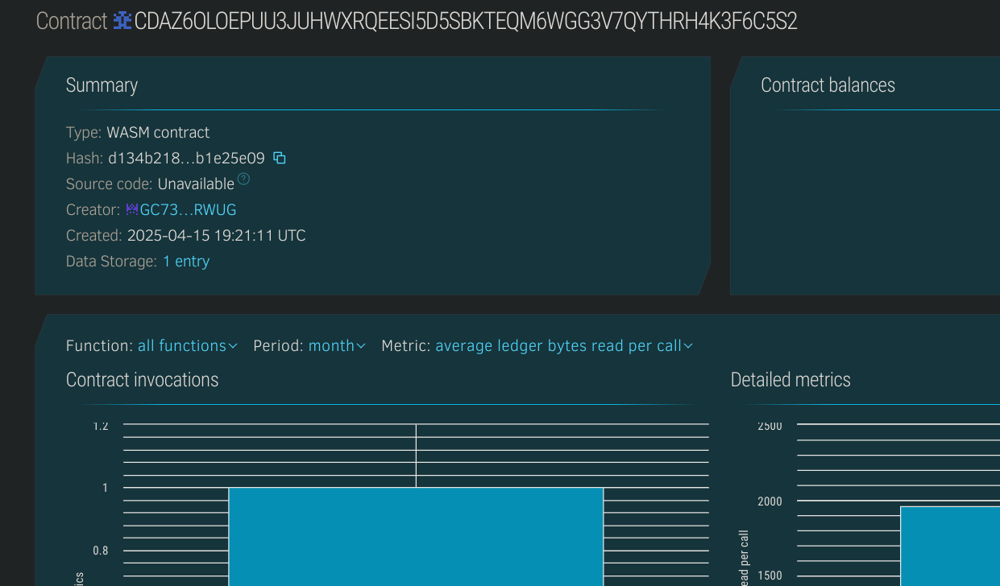

# Course Token Reward System

## Project Description
**Course Token Reward System** is a Soroban smart contract that rewards learners with tokens upon completing specific online courses. Each course has a unique ID and rewards are tied to user accounts.

## Project Vision
To incentivize lifelong learning by rewarding learners with blockchain-based tokens for completing educational content on decentralized or traditional platforms.

## Key Features
- 🎓 **Token Rewards**: Assign token rewards to users after course completion.
- 👤 **User-Based Tracking**: Rewards tied to specific user addresses.
- 📚 **Course-Specific Records**: Separate reward tracking per course.
- 🔍 **View Earned Tokens**: Users can view tokens earned per course.

## Future Scope
- 🎁 NFT badges for course completions.
- 🔗 Integration with learning platforms like Moodle or Coursera.
- 💸 Redemption system for earned tokens.
- 🏆 Leaderboard and reward-based competitions.

## Contract Details
CDAZ6OLOEPUU3JUHWXRQEESI5D5SBKTEQM6WGG3V7QYTHRH4K3F6C5S2
